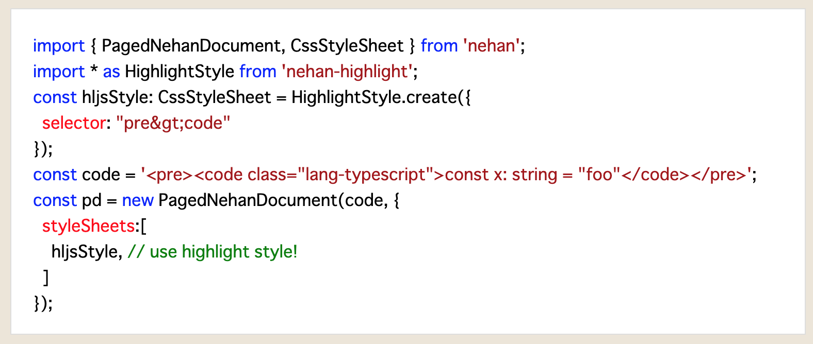

# nehan-highlight

[nehan](https://github.com/tategakibunko/nehan) plugin for code highlight.



## create nehan style

```typescript
import { PagedNehanDocument, CssStyleSheet } from 'nehan';
import * as HighlightStyle from 'nehan-highlight';

const hljsStyle: CssStyleSheet = HighlightStyle.create({
  selector: "pre>code"
});

const pd = new PagedNehanDocument('<pre><code class="lang-typescript">const x: string = "foo"</code></pre>', {
  styleSheets:[
    hljsStyle, // add highlight style!
  ]
});
```

## use markup

```html
<pre><code class="lang-typescript">
const x: string = "foo";
</code></pre>
```
